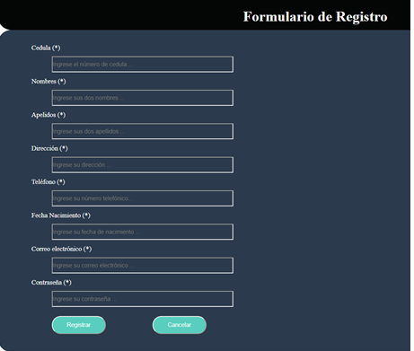
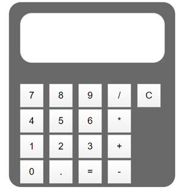
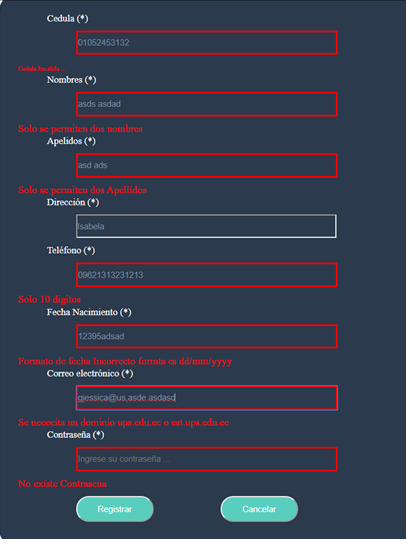
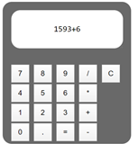

TÍTULO PRÁCTICA:
 
Resolución de problemas sobre JavaScript

OBJETIVO ALCANZADO:

• Entender y organizar de una mejor manera los sitios de web en Internet 
• Diseñar adecuadamente elementos gráficos en sitios web en Internet.
• Crear sitios web aplicando estándares actuales. 

ACTIVIDADES DESARROLLADAS USANDO JAVASCRIPT

1. Creación de un Repositorio en Github con sus respectivos commits, y creación de carpetas para cada ejercicio.

2. Crear una carpeta para la solución de cada ejercicio antes mencionado. Para la practica se creo tres carpetas para los ejercicios propuestos

	Se creo las carpetas para los ejercicios planteados en esta practica
	Calculadora
	Formulario
	Galeria

3. Realizar un commit y push por cada requerimiento de los puntos antes descritos.

Se realizo los commits y push de acuerdo a las indicaciones dadas en la practica

4. Generar informe

	a. Diseñar una interfaz HTML que permita ingresar los siguientes campoes en un formulario: cedula, nombre, apellidos, direccion,
	   telefono, fecha de nacimiento, correo y contraseña 

	</img>

	- Luego, usando funciones de JavaScript se pide validar que todos los campos han sido ingresados, además

	Indicaciones

	1. Se debe validar qué, en el campo de la cedula, se ingrese sólo números y que la misma sea correcta, en base, al último dígito verificador.
	2. Se debe validar qué, en el campo del nombre, ingrese exclusivamente dos nombres y que permita ingresar sólo letras, por ejemplo: “Jessica Maribel”, es válido; “Jessica”, no es válido.
	3. Se debe validar qué, en el campo del apellido, ingrese exclusivamente dos apellidos y que permita ingresar sólo letras, por ejemplo: “Guncay Carchipulla”, es válido; “Guncay”, no es válido.
	4. Se debe validar qué, en el campo del teléfono, permita ingresar sólo números y un máximo de 10 caracteres numéricos.
	5. Se debe validar que la fecha de nacimiento ingrese en el formato dd/mm/yyyy.
	6. Se debe validar qué, en el campo correo electrónico, permita ingresar un correo válido. Se considera un correo válido, cuando comienza por tres o más valores alfanuméricos, luego un @, seguido por la extensión “ups.edu.ec” o “est.ups.edu.ec”.
	
	- Diseñar una interfaz en html que tenga tres botones que diga “Anterior”, “Iniciar”, “Siguiente”, y una imagen. Luego, desde javascript se debe controlar para al hacer clic sobre uno de los botones realice una acción relacionada a una galería de imágenes (ver ejemplo, https://gihp4c.blog.ups.edu.ec/)

	</img>

	Indicaciones

	1. Se debe tener, un arreglo con los nombres de diez imágenes, previamente descargadas y almacenadas en una carpeta llamada “images”.
	2. La galería de imágenes debe visualizar exclusivamente 5 imágenes. Cada vez que se haga clic en el botón iniciar se deben escoger de manera aleatoria cinco imágenes de las diez que se mostrarán en la galería de imágenes
	3. Al hacer clic en el botón siguiente o anterior se debe cambiar la imagen presentada en la galería.
	4. El cambio de imágenes debe simular un efecto, para lo cual, se debe usar las propiedades left o rigth.
	5. Al hacer clic en el botón siguiente y haber llegado a la última imagen disponible, el botón siguiente deberá ser deshabilitado (sólo cuando se ha llegado a la última imagen el botón siguiente deberá estar deshabilitado)
	6. Al hacer clic en el botón anterior y haber llegado a la primera imagen disponible, el botón anterior deberá ser deshabilitado (sólo cuando se ha llegado a la última imagen y cuando se inicie la galería de imágenes el botón anterior deberá estar deshabilitado)
	- Realizar una calculara en HTML usando botones de javascript y una caja de texto para visualizar el resultado

	</img>

	1. Las operaciones que podrá hacer la calculadora son: suma, resta, multiplicación y división. Además, se podrá limpiar la memoria de la calculadora. Por último, se debe usar la función eval() para realizar las operaciones aritméticas
	b. La evidencia del correcto diseño de las páginas HTML usando CSS. Para lo cual, se puede generar fotografías instantáneas (pantallazos).
	- Para el formulario

	</img>

	- Para la Galeria de imágenes

	</img>

	- Para el desarrollo de una Calculadora Básica

	</img>

	c. La evidencia del correcto funcionamiento de cada una de las funciones de JavaScript
	- Para el correcto funcionamiento del Formulario se muestra la siguiente evidencia
	Se muestra un mensaje de error cuando se ingresa una cedula que no existe, mas de dos nombres, mas de dos apellidos, mas de diez dígitos del teléfono, validar el correo con dominio est.ups.edu.ec o ups.edu.ec. También validar la fecha que tenga formato dd/mm/yyyy asi como también la contraseña que tenga más de 8 caracteres, letras mayúsculas y minúsculas y un carácter especial.
	- Para el desarrollo de la Galería de Imágenes se muestra continuación
	Cuando se da clic en el botón iniciar se cargar imágenes pandémicas y se habilita los botones de anterior y siguiente 

	- Para el desarrollo de la Calculadora se muestra a continuación como está desarrollada 

RESULTADO(S) OBTENIDO(S):

•	Se logro entender y mejorar de una mejor manera los sitios de web en Internet para lo cual empleamos funciones dentro de javascript permitiendo crear efectos, animaciones, acciones que se pueden activar al pulsar botones y ventanas con mensajes en consola o en el navegador, para las paginas HTML, tomando en cuenta que javascript usamos para crear paginas webs dinámicas.  

•	Cumplir con el correcto manejo de las funciones, que nos permite realizar procedimientos, conjunto de sentencias que realizan algún calculo como suma, resta o tarea. Para ello es necesario definir una función para que esta después sea llamada y sea ejecutada.

CONCLUSIONES:

•	Para el correcto manejo javascript se debe revisar su correcta sintaxis como por ejemplo de métodos, bucle for, como se emplea las variables. Así como también revisar que elementos o propiedades nos es útil para el desarrollo de esta práctica.

•	Es necesario implementar ciertas funciones que nos ayuden con la creación de una página web dinámica, que adquiera efectos como se implemento en el ejercicio de galería el movimiento de imágenes, así como también el usar métodos o funciones para el correcto manejo de validaciones de una cedula. Esto nos puede ser de gran utilidad para Formularios de Comentarios o citas, entre otros.

RECOMENDACIONES:

•	Se recomienda para la practica probar a lo menos en tres navegadores diferentes como Google Chrome, Firefox y Safari

•	Haber asistido a clases

•	Ante cualquier duda consultar al profesor de la asignatura
